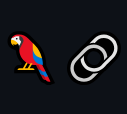

<h1 align="center">Hi 👋, I'm Jake Nolan</h1>
<h3 align="center" style="border-bottom: 0;">A passionate AI engineer and entrepreneur</h3>

 

💬 Ask me about **AI, LLMs, Gen AI, Business**

📫 How to reach me **jake@jakenolan.dev**

 

<h3 align="left">Connect with me:</h3>

  
  

 

<h3 align="left">Top Languages and Tools:</h3>

  
  
  
  
  

